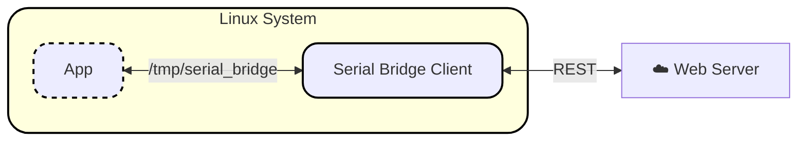

# serial-bridge-client

Run `serial_bridge` and expose it as a local virtual serial port (`/tmp/serial_bridge`) backed by the REST API.


## Required to run

- Linux/WSL: `./bin/linux-x64/serial_bridge`
- macOS: `./bin/macos-arm64/serial_bridge` or `./bin/macos-x64/serial_bridge`
- `socat` in `PATH`

Install `socat`:

```bash
# Debian/Ubuntu/WSL
sudo apt install socat

# macOS
brew install socat
```

## Quick start (Linux/WSL)

1. Make binary executable:

```bash
chmod +x ./bin/linux-x64/serial_bridge
chmod +x ./run-serial-bridge.sh
```

2. Configure auth and URL (choose one auth method):

Get credentials from the emulator at:
- `${BRIDGE_SERVER_URL}/user/login`
- Example: `https://kerong-modbus-emulator.vercel.app/user/login`

- Env vars:

```bash
export BRIDGE_SERVER_URL="http://127.0.0.1:5000"
export BRIDGE_USERNAME="<your-username>"
export BRIDGE_PASSWORD="<your-password>"
```

- Auth file:

```bash
cp examples/bridge-auth.json.example bridge-auth.json
export BRIDGE_SERVER_URL="http://127.0.0.1:5000"
export BRIDGE_AUTH_FILE="./bridge-auth.json"
```

3. Start the bridge:

```bash
./run-serial-bridge.sh
```

4. Verify PTY exists:

```bash
ls -la /tmp/serial_bridge
```

Your serial client should use `/tmp/serial_bridge`.

## Environment variables

- `BRIDGE_SERVER_URL` (required): API base URL.
- `BRIDGE_PTY_LINK` (optional, default `/tmp/serial_bridge`).
- `BRIDGE_BIN` (optional): binary path override.
- `BRIDGE_AUTH_FILE` (optional): JSON file with `token` or `username/password`.
- `BRIDGE_TOKEN` (optional): bearer token.
- `BRIDGE_USERNAME` / `BRIDGE_PASSWORD` (optional when using token or auth file).

If `BRIDGE_AUTH_FILE` is set, the script uses `--auth-file`.

## More docs

- Full quickstart and platform notes: [docs/quickstart.md](docs/quickstart.md)
- Linux runtime checklist: [docs/linux-runtime-checklist.md](docs/linux-runtime-checklist.md)
- Auth endpoint examples (Python/C++): [examples/auth_login/README.md](examples/auth_login/README.md)
- Protocol contract: [docs/contract.md](docs/contract.md)
- Troubleshooting: [docs/troubleshooting.md](docs/troubleshooting.md)
- Release and CI handoff: [docs/release-handoff.md](docs/release-handoff.md)
